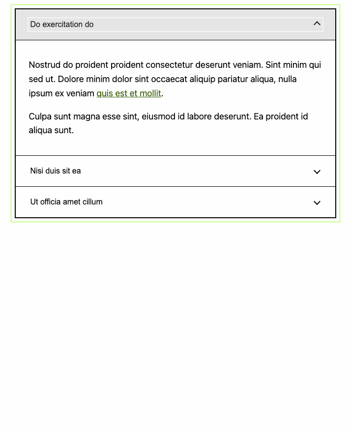

# Accordion block using ACF fields

An accordion block that uses ACF fields.

## How to use?

1. Download the latest release.
2. Install [ACF Pro](https://www.advancedcustomfields.com/pro/) plugin and activate.
3. Place the download in your site's `wp-content/plugins`
4. Activate ACF Accordion Block.
5. Create a new page, post and add the Accordion block.
